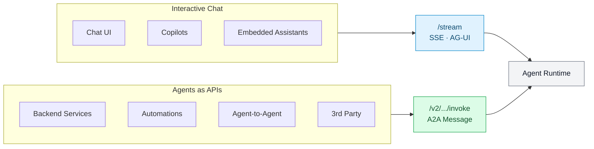
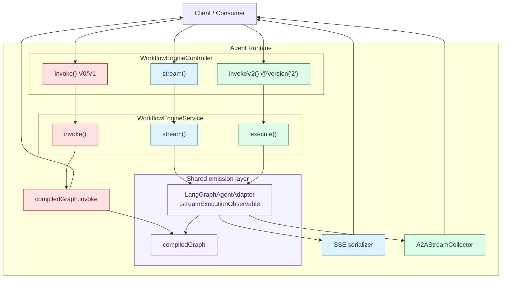
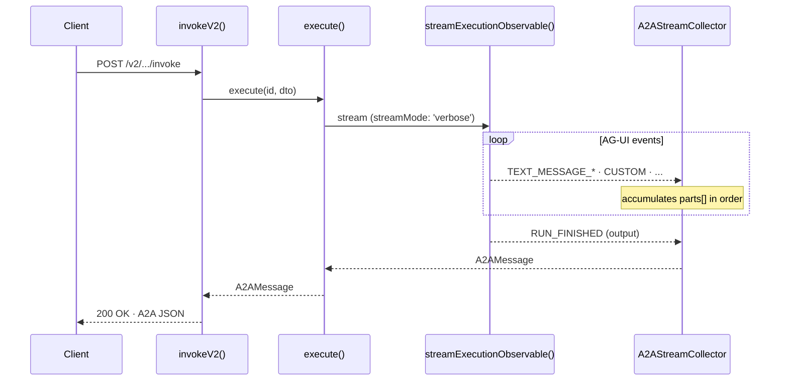
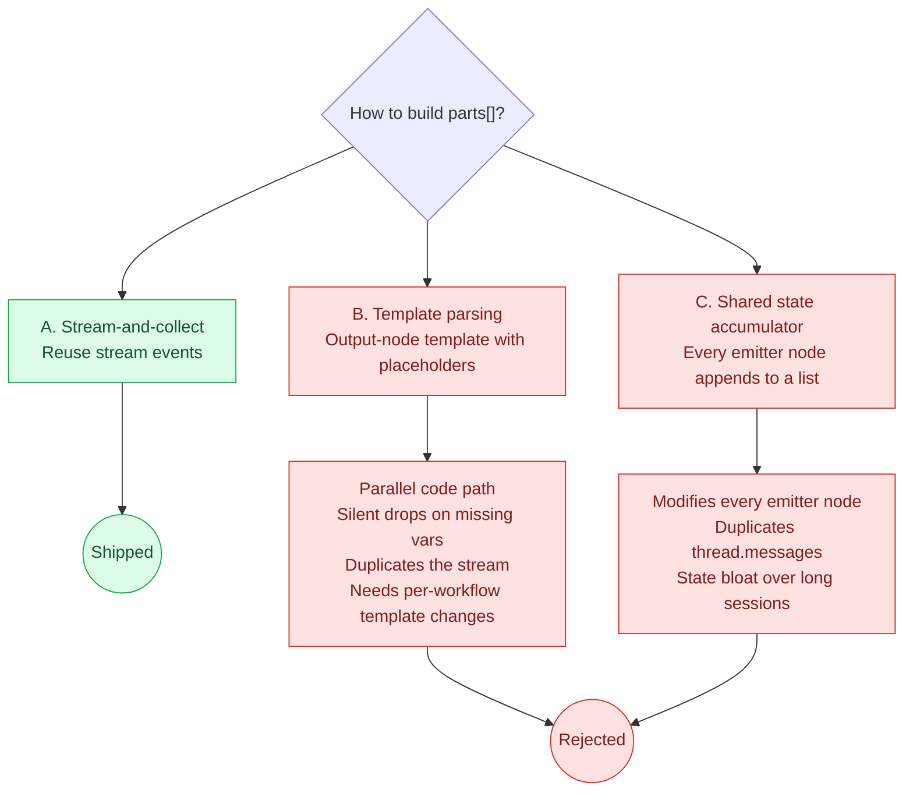
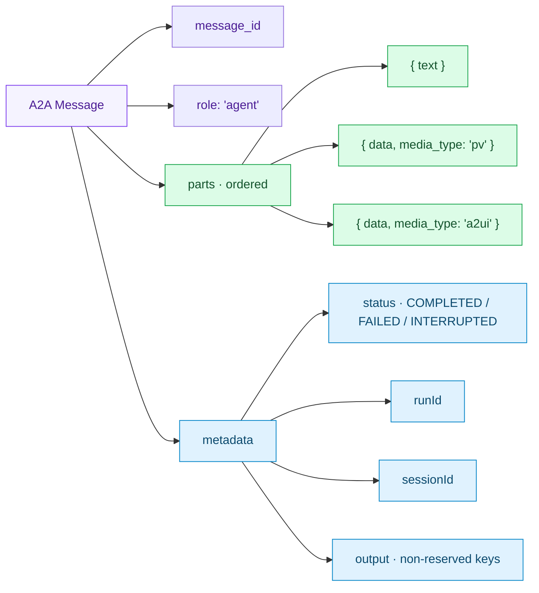
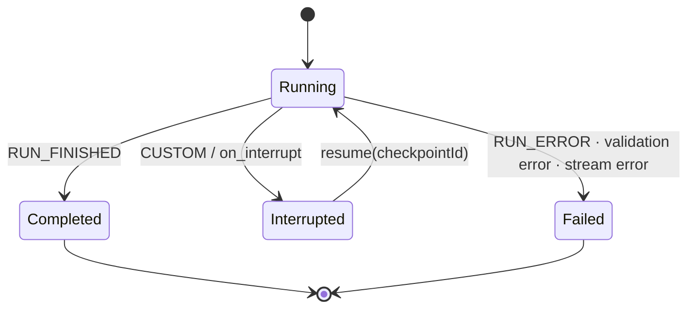
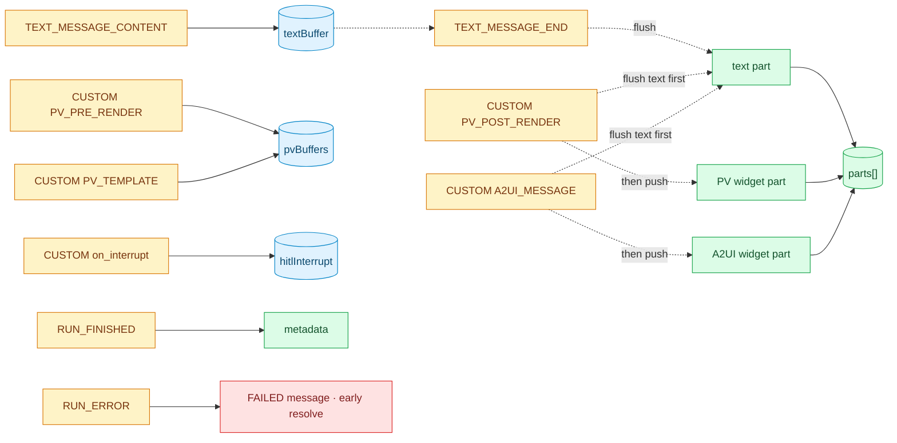

# ADR-007: Invoke V2 — A2A Message Response for Agents-as-APIs

---

## Abstract

The existing `/invoke` endpoint (V0/V1) returns a Leo-specific envelope (`GepReturnDto`) that drops widgets, has no ordering between text and widgets, leaks internal state, and does not validate inputs. It works as a chat-UI fallback, but not when an agent is called as an API — by another service, an automation, or a third-party integration.

**Invoke V2** replaces it with `POST /v2/workflow-engine/:id/invoke`, which returns an **A2A Message** (Google's open Agent-to-Agent protocol): an ordered `parts[]` of text and widgets, plus a clean `metadata` block.

> [!TIP]
> **In one sentence** — V2 runs the same streaming pipeline as `/stream`, and a subscriber (`A2AStreamCollector`) assembles the AG-UI event stream into an A2A Message. Zero new state variables. Zero schema changes on existing workflows.

---

## 0.5 Primer — quick definitions

This ADR uses a lot of short acronyms; here's the minimum you need.

**The two transports.** An agent (a workflow authored in the canvas) is reached at `/stream` (Server-Sent Events, live) or `/invoke` (single HTTP response). V0 and V1 of invoke return a Leo-specific `GepReturnDto`; **V2 returns an A2A Message** — this ADR.

**A2A Message.** Google's open [A2A protocol](https://a2a-protocol.org/latest/specification/) defines an agent's response as `{ message_id, role, parts[], metadata }`. Each `part` is text, structured data, or a widget tagged with a `media_type`.

**AG-UI.** The [event protocol](https://docs.ag-ui.com/) the stream emits and the V2 collector consumes. Relevant events: `TEXT_MESSAGE_START / CONTENT / END`, `CUSTOM` (widgets and interrupts), `RUN_FINISHED`, `RUN_ERROR`.

**Widgets.** Tools can emit two widget flavours — **PV** (Partial-View, three `CUSTOM` events, `media_type: "pv"`) and **A2UI** (single `CUSTOM` event, `media_type: "a2ui"`).

**HITL (Human-in-the-Loop).** A workflow can pause and wait for a human action. V2 surfaces this as `metadata.status = "INTERRUPTED"` with a `checkpointId` the caller uses to resume.

> [!TIP]
> **TL;DR** — V2 returns an A2A Message = ordered `parts[]` + `metadata`. The same AG-UI events that feed `/stream` also feed V2, just collected instead of streamed.


## 1. Why this ADR exists

### 1.1 Two audiences, two transports



The streaming path has long been feature-complete — tokens, tool calls, step events, widgets, HITL interrupts — all as AG-UI events. The invoke path was bolted on later as a simpler `compiledGraph.invoke()` call. It works for chat-UI fallbacks, but falls short when the caller *is* an API consumer.

### 1.2 What V0/V1 invoke returns today

```json
{
  "isSuccess": true,
  "returnValue": {
    "messages": [ "..." ],
    "selectedAgentId": "...",
    "state": { "flow": {}, "system": {}, "nodes": {} }
  }
}
```

### 1.3 Five problems with that

- **Widgets are lost.** PV widgets are dispatched as `CUSTOM` SSE events (`PV_PRE_RENDER` / `PV_TEMPLATE` / `PV_POST_RENDER`). The blocking `invoke()` path never sees them.
- **No content ordering.** If an agent produces `text → widget → text`, the response can't represent that sequence.
- **Proprietary format.** Every consumer must learn `GepReturnDto`. No open standard.
- **State leaks.** `flow` / `system` / `nodes` are exposed alongside the answer, with no separation between "the answer" and "internals".
- **No input validation.** A malformed request starts executing anyway; the LLM sees garbage and either hallucinates or crashes.

### 1.4 Why now

Product direction is moving toward **agents as APIs** — callable by other services, automations, agent-to-agent orchestrators, and external integrations. Those consumers want a structured, ordered, standards-compliant response. V1 does not deliver that.

### 1.5 Goals

| ID  | Goal                                                                           | Priority |
| --- | ------------------------------------------------------------------------------ | -------- |
| G1  | Return A2A `Message { message_id, role, parts[], metadata }`                   | P0       |
| G2  | Preserve order of text and widgets as the agent produced them                  | P0       |
| G3  | Include widgets (PV, A2UI) as first-class parts with `media_type`              | P0       |
| G4  | Clean separation — `parts[]` is the answer, `metadata` is side-channel         | P0       |
| G5  | No duplicated logic between stream and invoke                                  | P0       |
| G6  | HITL interrupts surface on invoke, not just stream                             | P0       |
| G7  | Validate inputs before execution starts                                        | P1       |
| G8  | Graceful fallback for workflows that do not emit events                        | P1       |
| G9  | `/stream` stays untouched                                                      | P0       |
| G10 | Works on existing workflows with zero schema changes                           | P1       |

---

## 2. The decision

> [!NOTE]
> **Chosen approach — stream-and-collect.**
> Invoke V2 runs the same streaming pipeline as `/stream`. A subscriber (`A2AStreamCollector`) turns the AG-UI event stream into an A2A Message.
>
> No new state variables. No output-node templating. No per-node wiring.
> **If a workflow streams correctly, it invokes correctly.**

### 2.1 High-level architecture



The critical property: **`/stream` and `/v2/.../invoke` share the same `streamExecutionObservable(...)` emitter.** Only the subscriber differs.

### 2.2 Call flow



### 2.3 Why not the alternatives



## 3. What consumers see

### 3.1 Happy path

**Request**

```http
POST /v2/workflow-engine/wf-abc-123/invoke
Content-Type: application/json

{
  "bpc": "BPC001",
  "environment": "DEV",
  "version": "1.0",
  "interface": {
    "inputs": { "message": "Show me my recent orders" }
  },
  "options": { "sessionId": "session-001" }
}
```

**Response**

```json
{
  "message_id": "msg_run_1709024400_abc123",
  "role": "agent",
  "parts": [
    { "text": "Here are your recent orders:" },
    {
      "data": {
        "preText": "Looking up order...",
        "template": "<OrderTracker orderId='12345' />",
        "postText": "Order found."
      },
      "media_type": "pv"
    },
    { "text": "Let me know if you need anything else." }
  ],
  "metadata": {
    "status": "COMPLETED",
    "runId": "run_1709024400_abc123",
    "sessionId": "session-001",
    "output": {
      "selectedAgentId": "wf-abc-123",
      "selectedAgentName": "Order Agent"
    }
  }
}
```

The client renders `parts` top to bottom. **`text → widget → text`, exactly as the agent produced them.**

### 3.2 Response anatomy



### 3.3 HITL interrupt

```json
{
  "message_id": "msg_run_xyz",
  "role": "agent",
  "parts": [
    { "text": "Please approve this refund before I continue." }
  ],
  "metadata": {
    "status": "INTERRUPTED",
    "runId": "run_xyz",
    "sessionId": "session-001",
    "output": {
      "interrupt": {
        "checkpointId": "...",
        "nodeId": "approval-node",
        "payload": { "message": "Please approve this refund before I continue." }
      }
    }
  }
}
```

Resuming: the consumer calls `/v2/.../invoke` again with `options.resume.metadata.checkpointId`. The service replays events from the checkpoint and returns another A2A Message (completed, interrupted again, or failed).

### 3.4 Run lifecycle



### 3.5 Error

```json
{
  "message_id": "msg_error_1709024400",
  "role": "agent",
  "parts": [{ "text": "Input validation failed: message: Required" }],
  "metadata": {
    "status": "FAILED",
    "errorCode": "EXECUTION_ERROR",
    "runId": "run_error_1709024400",
    "sessionId": "session-001"
  }
}
```

> Errors always look like A2A Messages — same shape, different `status`.

> [!NOTE]
> Errors return **HTTP 200** with `metadata.status = "FAILED"`. The route is annotated `@HttpCode(HttpStatus.OK)`; 4xx/5xx are reserved for infrastructure-level failures (auth, routing) that never reach the collector.

---

## 4. How it works

### 4.1 The `A2AMessage` type

Defined in `services/libs/shared/src/dtos/a2a/a2a.types.ts`.

```typescript
export interface A2APart {
  text?: string;
  data?: any;
  media_type?: string;   // "pv" | "a2ui" | future
  metadata?: Record<string, any>;
}

export interface A2AMessage {
  message_id: string;
  role: 'user' | 'agent';
  parts: A2APart[];
  metadata?: Record<string, any>;
}
```

Three part kinds show up in V2 responses:

- **Text** — `{ text: "..." }` — emitted when an agent or LLM node produces natural language.
- **PV widget** — `{ data: { preText, template, postText }, media_type: "pv" }` — emitted when a Partial-View tool runs.
- **A2UI widget** — `{ data: { surfaceId, rendererType, payload, ... }, media_type: "a2ui" }` — emitted when an A2UI-capable tool runs.

### 4.2 The collector — `A2AStreamCollector`

Located at `services/libs/agentic-engine/src/workflow-execution/A2AStreamCollector.ts`. One public method:

```typescript
A2AStreamCollector.collect(stream$, runId, sessionId): Promise<A2AMessage>
```

**State held while the stream runs**

- `parts: A2APart[]` — the ordered output being built.
- `textBuffer: string` — in-flight text between `TEXT_MESSAGE_START` and `TEXT_MESSAGE_END`.
- `pvBuffers: Map<toolCallId`, { preText, template, postText }> — in-flight PV widget, keyed by toolCallId (the ID carried on all three PV_* events so pre/template/post reliably pair up).
- `hitlInterrupt: object | null` — latest `on_interrupt` payload, if any.

**Event → action**



> [!NOTE]
> **Why text is flushed before a widget push** — order preservation. If the LLM says *"here you go:"* and then a tool fires, the text must land in `parts` before the widget.

**On stream `complete`**

1. Flush any leftover `textBuffer`.
2. Build `metadata` from `RUN_FINISHED.result.output` (strip the reserved `messages` key).
3. If an interrupt was captured — set `metadata.status = 'INTERRUPTED'`, nest the payload under `metadata.output.interrupt`, push a text part with the interrupt message.
4. If `parts` is still empty — fall back to the last AI message from `output.messages` as a single text part.
5. Resolve `{ message_id: 'msg_' + runId, role: 'agent', parts, metadata }`.

**Early resolve on error**. If a RUN_ERROR event arrives mid-stream, the collector short-circuits — it resolves immediately with a FAILED A2A Message and discards any buffered content. The complete handler above does not run.

**Interrupt text fallback**. If the on_interrupt payload has no payload.message, the collector pushes a default text part: "Action required before the workflow can continue."

**Ignored events** — `TOOL_CALL_*`, `STEP_*`, `STATE_*`, `REASONING_ENCRYPTED_VALUE`, `RUN_STARTED`, `TEXT_MESSAGE_START` (implicit).

### 4.3 Metadata

Top-level fields the collector always sets:

- `status` — `"COMPLETED"` / `"FAILED"` / `"INTERRUPTED"`
- `errorCode` — string, only on failure
- `runId` — `run_{timestamp}_{random}`
- `sessionId` — from the request, or auto-generated
- `output` — non-reserved output-node keys (omitted if empty)

> The only **reserved key** is `messages` (conversation history). Everything else on the output node — `selectedAgentId`, `selectedAgentName`, user keys like `relatedQuestions` — flows through to `metadata.output`.

### 4.4 Input validation (Start node)

The Start node (`services/libs/agentic-engine/src/nodes/StartNode.ts`) supports a JSON-Schema-flavoured config called `inputValidation`.

```json
{
  "inputValidation": {
    "properties": {
      "message":     { "type": "string", "minLength": 1 },
      "attachments": { "type": "array" },
      "count":       { "type": "number", "minimum": 1, "maximum": 100 }
    },
    "required": ["message"]
  }
}
```

At run start, `StartNode` builds a Zod schema from `properties` and runs `safeParse` on `interface.inputs`. On failure it throws, the graph emits `RUN_ERROR`, and the collector surfaces a `FAILED` A2A Message with a human-readable issue list.

**Supported types and validators**

| Type      | Extra validators                            |
| --------- | ------------------------------------------- |
| `string`  | `minLength`, `maxLength`, `pattern`, `enum` |
| `number`  | `minimum`, `maximum`                        |
| `boolean` | —                                           |
| `array`   | items are `z.any()`                         |
| `object`  | treated as `z.record(z.any())`              |

If `inputValidation` is not configured, validation is skipped — backward-compatible.

### 4.5 End-to-end code — the V2 path

**Controller** (`workflow-engine.controller.ts`)

```typescript
@Post(':id/invoke')
@Version('2')
@HttpCode(HttpStatus.OK)
async invokeV2(
  @Param('id') id: string,
  @Body() request: InvokeApiRequestV1,
): Promise<A2AMessage> {
  try {
    if (!request.options) { /* defaults */ }
    if (!request.options.sessionId) {
      request.options.sessionId = uuidv4();
    }
    const dto = this.dtoAdapter.v1ToInternal(request);
    return await this.workflowEngine.execute(id, dto);
  } catch (error) {
    return A2AResponseTransformer.buildErrorMessage(
      error.message ?? 'An unexpected error occurred',
      `run_error_${Date.now()}`,
      request.options?.sessionId ?? 'unknown',
      'EXECUTION_ERROR',
    );
  }
}
```

**Service** (`workflow-engine.service.ts`)

```typescript
async execute(id: string, invokeRequest: InvokeRequestDto): Promise<A2AMessage> {
  this.request.headers['RuntimeToken'] = invokeRequest.options?.runtimeToken ?? '';
  const headers = this.request.headers as Record<string, string>;

  // HITL resume path omitted for brevity

  const { compiledGraph, processedSchema } = await this.createGraph(id, invokeRequest);
  const langfuseCallback = this.createLangfuseCallback(id, invokeRequest /* ... */);

  const sessionId = invokeRequest.options?.sessionId || 'default';
  const runId = `run_${Date.now()}_${Math.random().toString(36).substr(2, 9)}`;

  const adapterRequest = WorkflowExecutionHelper.buildGraphRequest(
    id,
    invokeRequest,
    interfaceInputs,
    headers,
    [langfuseCallback],
    this.buildRuntimeContextForRequest(id, invokeRequest /* ... */),
  );
  adapterRequest.config = { ...adapterRequest.config, streamMode: 'verbose' };

  const stream$ = this.adapter.streamExecutionObservable(compiledGraph, adapterRequest);
  const tapped$ = await this.wrapV2WithSessionCapture(id, invokeRequest, sessionId, stream$);
  return A2AStreamCollector.collect(tapped$, runId, sessionId);
}
```

Three points worth noting:

- **`streamMode: 'verbose'` is forced.** `minimal` mode would drop PV widgets.
- **Runtime headers** — execute() writes RuntimeToken onto this.request.headers and forwards the full headers map to WorkflowExecutionHelper.buildGraphRequest(...). Tools needing header-based auth receive the same headers the stream path does. buildRuntimeContextForRequest(...) is a separate contributor (it supplies envVars and workflowMetaData, not headers).

### 4.6 HITL resume

Same endpoint. The caller sets `options.resume.metadata.checkpointId`. The service detects it, calls `handleResume(id, request, headers)` (shared with the stream path), unwraps `{ data, type }` wrappers into raw AG-UI events, and feeds them into `A2AStreamCollector.collect(...)`. Resume responses return the same A2A shape — completed, interrupted again, or failed.

### 4.7 Three versions coexist

| Version | URL | Request shape | Returns |
| --- | --- | --- | --- |
| V0 (default / unversioned) | `POST /workflow-engine/:id/invoke` (also `/v0/workflow-engine/:id/invoke`) | `InvokeApiRequestV0` — message-based | `GepReturnDto` |
| V1 | `POST /v1/workflow-engine/:id/invoke` | `InvokeApiRequestV1` — interface-based (`interface.inputs.*`) | `GepReturnDto` |
| **V2** | `POST /v2/workflow-engine/:id/invoke` | `InvokeApiRequestV1` (same as V1) | **`A2AMessage`** — this ADR |

V0 and V1 share the execution path (`workflowEngine.invoke()`) and the legacy `GepReturnDto` response; they differ only in the request DTO and its adapter (`v0ToInternal` vs `v1ToInternal`). V2 reuses V1's request shape and the same adapter, but swaps **both** the execution path (to `workflowEngine.execute()` — stream-and-collect) and the response (to A2A Message).

V0 and V1 stay live until internal consumers migrate. Deprecation will be a separate ADR.

---

## 5. Stream vs V2 invoke at a glance

| Aspect                   | `/stream`                 | `/v2/.../invoke`             |
| ------------------------ | ------------------------- | ---------------------------- |
| Transport                | SSE                       | HTTP JSON                    |
| Execution                | `streamExecutionObservable(...)` | Same, forced to `verbose` |
| Subscriber               | SSE serializer            | `A2AStreamCollector.collect` |
| Real-time events         | Yes                       | No (collected in-memory)     |
| Token streaming          | Yes                       | No (buffered per message)    |
| Widgets (PV, A2UI)       | Yes                       | Yes (in `parts[]`)           |
| HITL interrupts          | Yes                       | Yes (`status: INTERRUPTED`)  |
| Tool / step / state events | Yes                     | No (ignored)                 |
| Langfuse tracing         | Yes                       | Yes                          |

> [!TIP]
> Both paths share the same execution and event-emission code. **Anything the stream sees, the collector can see.** That is what makes feature parity free.

---

## 6. What's in the canvas

- **Endpoints panel** (`frontend/src/components/canvas/panel-content/EndpointsPanelContent.tsx`) — published vs development URL toggle, development token, code snippets in multiple languages, response schema and example.
- **Start node** — builders can add typed input fields with the validators in §4.4. `inputValidation` is optional.
- **Output node** — any key a builder adds (apart from the internal `messages`) appears in `metadata.output` of the V2 response.
- **Variables panel** — inspect Variables / Threads / Runtime state during a run.

---

## 7. Risks and trade-offs

| Risk                                                             | Impact               | Mitigation                                                                                   |
| ---------------------------------------------------------------- | -------------------- | -------------------------------------------------------------------------------------------- |
| Invoke runs the full streaming pipeline even without a client    | Minor overhead       | Acceptable — dominated by LLM latency. A separate path would drift from stream.              |
| Nodes that update state without emitting events are invisible    | Silent content loss  | Document in builder guidance; require `TEXT_MESSAGE_*` / `CUSTOM` emission for `parts[]`.     |
| Three invoke versions coexist                                    | Maintenance          | V0/V1 frozen; deprecation tracked separately.                                                 |
| Legacy `A2AResponseTransformer` is dead code in the success path | Reuse risk           | Header comment on `A2AStreamCollector.ts` documents the supersession; cleanup is tech debt.   |
| AG-UI event shapes change underneath us                          | Collector breaks     | Unit tests on the collector with representative event fixtures.                              |
| V0/V1 consumers assume `messages` is in the response             | Migration friction   | Called out in the Endpoints panel and migration notes.                                        |

---

## 8. Scope

### In scope

- `POST /v2/workflow-engine/:id/invoke` on both `core` and `portal-engine`
- `A2AStreamCollector` + `A2AMessage` / `A2APart` types
- HITL resume returning A2A
- Error A2A Messages (controller, execution, stream)
- Canvas Endpoints panel, Start-node validation, Variables panel
- Retaining legacy `A2AResponseTransformer.buildErrorMessage`

### Out of scope

| Feature                                                 | Why not now                                                      |
| ------------------------------------------------------- | ---------------------------------------------------------------- |
| Full A2A Task envelope (history + artifacts + JSON-RPC) | Consumers need only a Message today; Task can wrap Message later |
| Streaming A2A (A2A frames over SSE)                     | Stream already exists via AG-UI; add if consumers demand it      |
| Deprecation of V0/V1 invoke                             | Separate ADR once internal consumers have migrated               |
| AG-UI protocol compliance fixes                         | Separate ADR; unrelated to the V2 invoke contract                |

---

## 9. Files touched

### New

| File                                                                        | Purpose                                  |
| --------------------------------------------------------------------------- | ---------------------------------------- |
| `services/libs/agentic-engine/src/workflow-execution/A2AStreamCollector.ts` | Subscribes to stream, builds A2A Message |
| services/libs/shared/src/dtos/a2a/{a2a.types.ts, index.ts}                  | A2APart, A2AMessage types, barrel export |

### Modified

| File                                                                                   | Change                                                 |
| -------------------------------------------------------------------------------------- | ------------------------------------------------------ |
| `services/apps/{core,portal-engine}/src/workflow-engine/workflow-engine.controller.ts` | `invokeV2()` route with `@Version('2')`                |
| `services/apps/{core,portal-engine}/src/workflow-engine/workflow-engine.service.ts`    | `execute()` method; HITL resume returns A2A            |
| `services/libs/agentic-engine/src/nodes/StartNode.ts`                                  | Zod-based `inputValidation`                            |
| `services/libs/agentic-engine/src/index.ts`                                            | Re-exports A2AStreamCollector and A2AResponseTransformer.         |
| `frontend/src/components/canvas/panel-content/EndpointsPanelContent.tsx`               | Endpoints panel UI                                     |

### Retained as legacy

| File                                                                            | Status                                                         |
| ------------------------------------------------------------------------------- | -------------------------------------------------------------- |
| `services/libs/agentic-engine/src/workflow-execution/A2AResponseTransformer.ts` | Success path is dead code; kept for `buildErrorMessage` helper |

No new runtime dependencies — `zod` is already in the workspace.

---

## 10. Testing strategy (Planned)

| Test type                      | Coverage                                                                                          |
| ------------------------------ | ------------------------------------------------------------------------------------------------- |
| Unit — `A2AStreamCollector`    | Text-only, `text → widget → text` order, concurrent PV tools, A2UI, HITL, `RUN_ERROR`, fallback   |
| Unit — metadata                | `messages` excluded; custom output keys preserved                                                 |
| Unit — `StartNode` validation  | Required fields, type mismatches, `minLength` / `enum` / `pattern`                                |
| Integration — `invokeV2`       | End-to-end on both apps; includes HITL resume                                                     |
| Integration — error paths      | Controller DTO error, execution `RUN_ERROR`, stream subscription error                            |
| Regression                     | V0/V1 invoke and `/stream` continue to pass existing suites                                       |

---

## 11. Rollout

| Phase | Scope                                                                       | Status           |
| ----- | --------------------------------------------------------------------------- | ---------------- |
| **1** | V2 endpoint live alongside V0/V1; collector in production; Endpoints panel  | Complete         |
| **2** | Internal consumers migrate V0/V1 → V2                                       | In progress      |
| **3** | External / A2A-compatible consumers onboarded                               | Pending          |
| **4** | Deprecate V0/V1 invoke (separate ADR)                                       | Pending          |

**Feature flag** — none. V2 is additive.

**Rollback** — remove the `@Version('2')` decorator in both controllers. V0/V1 are untouched. No state-level rollback required because V2 introduces no state variables.

---

## 12. Consequences

**Positive**

- Open-standard response — any A2A client consumes our agents without custom code
- Content order preserved end-to-end (G2) with zero builder effort (G10)
- PV and A2UI widgets as first-class response citizens (G3)
- Clean metadata separation (G4)
- No code duplication between stream and invoke (G5)
- HITL works on invoke (G6)
- Errors look the same as successes — uniform A2A Messages

**Negative**

- Invoke pays the cost of the full streaming pipeline
- Three invoke versions coexist until deprecation
- Legacy `A2AResponseTransformer` is dead code in the success path
- Only streamed content reaches the response — state-only updates are invisible

**Neutral**

- `/stream` unchanged
- V0/V1 invoke unchanged
- No new runtime dependencies

---

## 13. Related documents

- [ADR-002: Workflow Node](./ADR-002-workflow-node.md)
- [ADR-005: HITL — Human in the Loop](./ADR-005-hitl-human-in-the-loop.md)
- [A2A Protocol Specification](https://a2a-protocol.org/latest/specification/)
- [AG-UI Protocol Documentation](https://docs.ag-ui.com/)

---

<details>
<summary><strong>Appendix A — AG-UI events and how V2 uses them</strong></summary>

| Event                               | Consumed?               |
| ----------------------------------- | ----------------------- |
| `RUN_STARTED`                       | No                      |
| `RUN_FINISHED`                      | Yes — `metadata.output` |
| `RUN_ERROR`                         | Yes — resolves FAILED   |
| `TEXT_MESSAGE_START`                | No (implicit)           |
| `TEXT_MESSAGE_CONTENT`              | Yes — buffer            |
| `TEXT_MESSAGE_END`                  | Yes — flush text part   |
| `TOOL_CALL_START / ARGS / END / RESULT` | No                  |
| `STEP_STARTED` / `STEP_FINISHED`    | No                      |
| `STATE_SNAPSHOT` / `STATE_DELTA`    | No                      |
| `REASONING_ENCRYPTED_VALUE`         | No                      |
| `CUSTOM / PV_PRE_RENDER`            | Yes — open PV buffer    |
| `CUSTOM / PV_TEMPLATE`              | Yes — set PV template   |
| `CUSTOM / PV_POST_RENDER`           | Yes — push PV part      |
| `CUSTOM / A2UI_MESSAGE`             | Yes — push A2UI part    |
| `CUSTOM / on_interrupt`             | Yes — mark INTERRUPTED  |

</details>

<details>
<summary><strong>Appendix B — End-to-end trace</strong></summary>

**Scenario** — *"Show me my recent orders"*

**Events emitted by the shared streaming pipeline**

1. `RUN_STARTED`
2. `TEXT_MESSAGE_START` → `TEXT_MESSAGE_CONTENT("Here are your recent orders:")` → `TEXT_MESSAGE_END`
3. `CUSTOM / PV_PRE_RENDER (toolCallId=t1, delta="Looking up order...")`
4. `CUSTOM / PV_TEMPLATE (toolCallId=t1, delta="<OrderTracker orderId='12345' />")`
5. `CUSTOM / PV_POST_RENDER (toolCallId=t1, delta="Order found.")`
6. `TEXT_MESSAGE_START` → `TEXT_MESSAGE_CONTENT("Let me know if you need anything else.")` → `TEXT_MESSAGE_END`
7. `RUN_FINISHED (result.output = { selectedAgentId, selectedAgentName, messages: [...] })`

**Collector state after each event**

| After event        | `parts` length | Buffers                                                                              |
| ------------------ | -------------- | ------------------------------------------------------------------------------------ |
| 2 — TEXT_END       | 1              | `textBuffer=""`, `pvBuffers={}`                                                      |
| 3 — PV_PRE_RENDER  | 1              | `pvBuffers={ t1: { preText: "Looking...", template: "", postText: "" } }`            |
| 4 — PV_TEMPLATE    | 1              | `pvBuffers={ t1: { preText: "Looking...", template: "<OrderTracker/>", postText: "" } }` |
| 5 — PV_POST_RENDER | 2              | `pvBuffers={}` (flushed into `parts`)                                                |
| 6 — TEXT_END       | 3              | `textBuffer=""`, `pvBuffers={}`                                                      |
| 7 — RUN_FINISHED   | 3              | Metadata built from `result.output`                                                  |

The final A2A Message is the one shown in §3.1.

</details>

---


